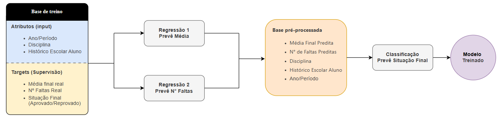

# Prospecção de Fatores de Desempenho e Predição de Situação Acadêmica  
**Trabalho Final – Reconhecimento de Padrões (2025/2)**  
**Universidade Federal de Uberlândia (UFU)**

Este repositório contém os códigos, dados, análises e resultados referentes ao projeto desenvolvido na disciplina de **Reconhecimento de Padrões**.  
O objetivo é construir um **framework preditivo de duas etapas** para classificar o desempenho de estudantes em disciplinas universitárias, com foco em:

- Identificação precoce de risco de reprovação  
- Minimização de *data leakage*  
- Melhoria da capacidade explicativa dos modelos

---

## 🧠 O Framework Proposto

Para evitar vazamento de dados e respeitar o fluxo temporal das informações acadêmicas, o framework é dividido em duas etapas:

### **Etapa 1 – Regressão**
Modelos preditivos estimam:

- **Nota Final**
- **Número de Faltas**

Usando **somente informações históricas passadas**:  
ex.: taxa de aprovação acumulada, reprovações prévias, média geral, coeficiente de rendimento etc.

### **Etapa 2 – Classificação**
Um classificador utiliza:

- As predições da Etapa 1  
- O histórico escolar  
- Características da disciplina  

para prever a **situação final**: Aprovado/Reprovado.

Esse design reduz significativamente riscos de *data leakage*. A arquitetura do framework está ilustrada abaixo.



---

## 🛠️ Principais Tecnologias

- **Linguagem:** Python 3.x  
- **Bibliotecas:** Pandas, NumPy, Scikit-Learn, Matplotlib, Seaborn  
- **Modelos Utilizados:**  
  - Random Forest  
  - SVM (Linear)  
  - Árvore de Decisão  
  - KNN  

---

## 📂 Estrutura do Repositório

```
├── data/
│ ├── raw/ # Base de dados original
│ └── processed/ # Dados pré-processados e com features criadas
│
├── notebooks/
│ ├── 01_Pre_Processamento.ipynb # Limpeza e feature engineering
│ ├── 02_Etapa1_Regressao.ipynb # Regressão: previsão de nota/faltas
│ └── 03_Etapa2_Classificacao.ipynb # Classificação final
```


---

## 🚀 Como Executar

### **1. Instale as dependências**
Recomenda-se o Google Colab.

```
Acesse: https://colab.research.google.com

Clique em File → Upload notebook

Envie seu arquivo .ipynb

Clique em Runtime → Run all
```

## Autores
- Iago Garcia Vargas
- Lara Mondini Martins
- Dâmaris Suelen Silva
